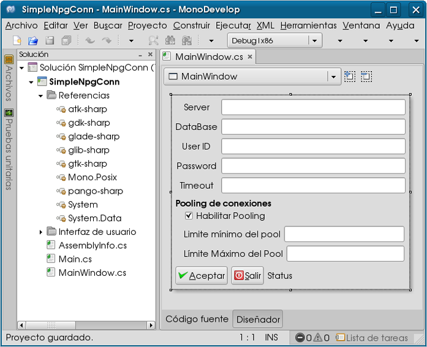
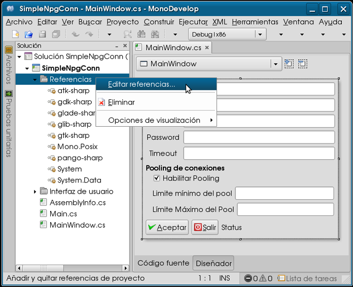
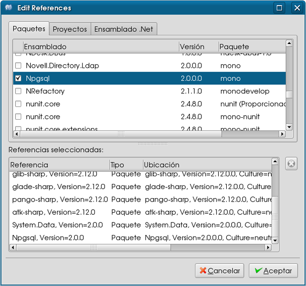
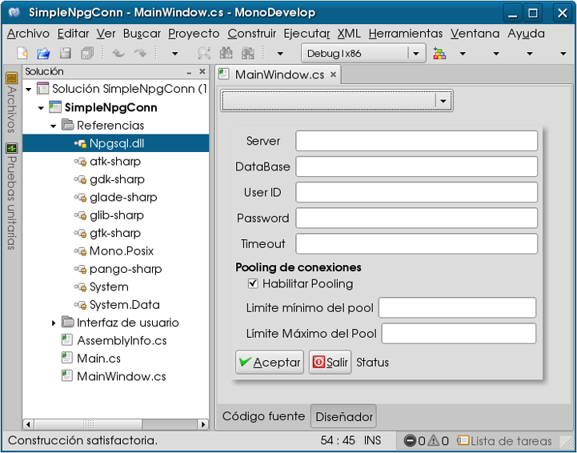
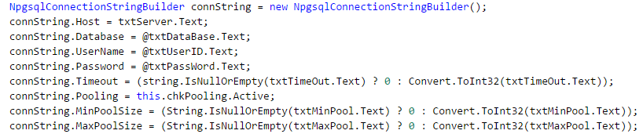
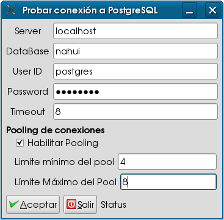
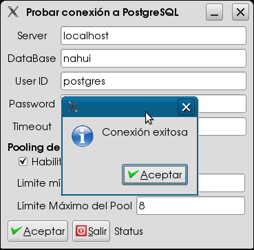
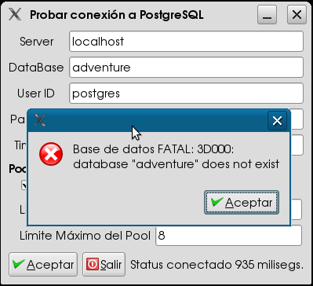

# Utilizando los objetos NpgsqlConnection y NpgConnectionStringBuilder para PostgreSQL con MonoDevelop

Hoy día es difícil imaginarse un sistema informático que no haga uso de fuente de datos para persistir información.
Entre estas fuentes de datos se encuentran:

<ul>
<li>Sin estructura: Archivos que no tienen un orden lógico. (Cartas, memos)</li>
<li>Estructurado, sin jerarquía: Contienen datos agrupados por separadores o indicadores de inicio y fin (archivos de acceso secuencial, archivos separados por tabuladores ó comas)</li>
<li>Jerárquica: tienen una estructura de nodos anidados. (XML)</li>
<li>Bases de datos relacionales: Todas los gestores de base de datos</li>
<li>Objetos: Los datos están organizados como objetos.</li>
</ul>

Debido a esta variedad, las clases de ADO para acceder y extraer cuentan con un diseño independiente y portable de la implementación de la fuente de datos que se utilice.
Desde luego, primeramente debemos tener acceso a la fuente de datos antes de ejecutar operaciones de consulta o modificación.
Para lograr este propósito usamos un objeto proveedor de conexión especifico según la fuente de datos a utilizar, cada uno de estos objetos son equivalentes en funcionalidades generales por derivar de la clase DBConnection.
Aunque estos objetos son equivalentes en la funcionalidad general, cada uno tiene código específico para su fuente de datos, como se muestra en la tabla siguiente.

<pre>
+-----------------+-------------------+
| Fuente de datos |Objeto de conexión |
+-----------------+-------------------+
| SQL Server      | SqlConnection     |
+-----------------+-------------------+
| Suportan OLE DB | OleDbConnection   |
+-----------------+-------------------+
| Oracle          | Oracleconnection* |
+-----------------+-------------------+
| PostgreSQL      | NpgsqlConnection  |
+-----------------+-------------------+
</pre>
<i>*Depende de que el cliente de Oracle se encuentre instalado.</i>
<h3>El objeto NpgsqlConnection</H3>

Un objeto conexión representa una conexión física a una fuente de datos, por lo que una de las mejores recomendaciones es conectarse y cerrar las conexiones abiertas en cuanto dejen de utilizarse.
ConnectionStrings (Cadenas de conexión)
Antes de trabajar con cualquiera de los objetos de conexión es indispensable proporcionarle la Connection String (cadena de conexión) , esta Connection String es propia de cada objeto Connection y cada objeto Connection es propio de cada fuente de datos con la que trabajemos.
La cadena de conexión es una serie de parámetros y valores separados por (;) y aunque cada Connection String cambie según el proveedor de Base de datos, hay ciertos parámetros que son siempre requeridos, como:

<pre>
+---------------------------+-------------------------------------------------+
|Data Source o Server       | El lugar donde se encuentra la fuente de datos: |
                            | servidor, máquina, lugar de red, IP, directorio,|
                            | archivo.                                        |
+---------------------------+-------------------------------------------------+
DataBase o Initial Catalog  | El nombre de la base de datos a usar.           |
+---------------------------+-------------------------------------------------+
|User ID                    | El usuario para acceder.                        |
+---------------------------+-------------------------------------------------+
 Password                   | El password del usuario para aceder             |
+---------------------------+-------------------------------------------------+
Integrated Security         | Si es true se utiliza la seguridad de Windows 
                            | para acceder, si es false se debe de proporcionar 
                            | el user y password para acceder.
+---------------------------+-------------------------------------------------+
Timeout o Connection Timeout| El tiempo que debe esperar la aplicación para   |
                            | que el servidor le asigne una conexión.         |
                            | El valor predeterminado es de 15 segundos       |
+---------------------------+-------------------------------------------------+
Pooling                     | Crea un pool de conexiones para la cadena de    |
                            | conexión si no existe, caso contrario           |
                            | asigna una conexión de un pool existente.       |
+---------------------------+-------------------------------------------------+
MinPoolSize                 | Número mínimo de conexiones por pool, valor     |
                            | predeterminado 1                                |
+---------------------------+-------------------------------------------------+
MaxPoolSize                 | Número máximo de conexiones por pool, valor     |
                            | máximo permitido 100                            |
+---------------------------+-------------------------------------------------+
</pre>

El sitio Connection Strings.com contiene ejemplos y una amplia referencia a cada uno de los parámetros y valores según la fuente de datos.
<h3>El objeto NpgsqlConnectionStringBuilder</H3>

Hay una clase que nos ayuda a evitar errores de sintaxis al momento de construir cadenas de conexión, esto para no tener recordar cada una de las opciones en el caso de trabajar con diferentes bases de datos. Esta clase es similar a las clases Connection, hay una clase DbConnectionStringBuilder de donde surgen las objetos ConnectionStringBuilder específicos para cada cadena de conexión de cada objeto Connection.
Derivados de la clase DbConnectionStringBuilder, existe la clases NpgsqlConnectionStringBuilder la cual encapsula una ConnectionString (cadena de conexión) para PostgreSQL, la cual demostraremos en el siguiente programa junto con el uso de la clase NpgsqlConnection respectivamente.

Abrimos MonoDevelop, creamos una nueva solución GTK# y agregamos unos controles al formulario para que su aspecto luzca como en la siguiente imagen.

Como utilizaremos el proveedor de datos de PostgreSQL para .NET debemos agregarlo a la solución, hacemos click derecho en la solución(recomiendo la versión 2.x).

Aparecerá la ventana para agregar/quitar las referencias a los ensamblados instalados en el GAC o para buscarlos en el sistema de archivos.

Una vez agregado correctamente, se mostrará el ensamblado en la solución.

Dentro del método para dar funcionalidad al botón de aceptar, mostramos la utilización de la clase NpgsqlConnectionStringBuilder como ayuda para crear la cadena de conexión.

También dentro de este método tenemos el código para la creación de la conexión al servidor.

<pre>
using(NpgsqlConnection conn = new NpgsqlConnection(connString.ToString())){
conn.Open();
if(conn.State ==  System.Data.ConnectionState.Open)
  MessageBox("Conexión exitosa",MessageType.Info);
}
</pre>

Si descargamos el código completo del proyecto, al compilarlo correctamente y ejecutarlo,nos pedirá teclear los parámetros para una conexión hacia un servidor PostgreSQL.

Si los parámetros son correctos y el servidor se encuentra disponible entonces la aplicación mostrará el mensaje siguiente:

En caso de un parámetro incorrecto nos mostrará los mensajes de la excepción recibida.

